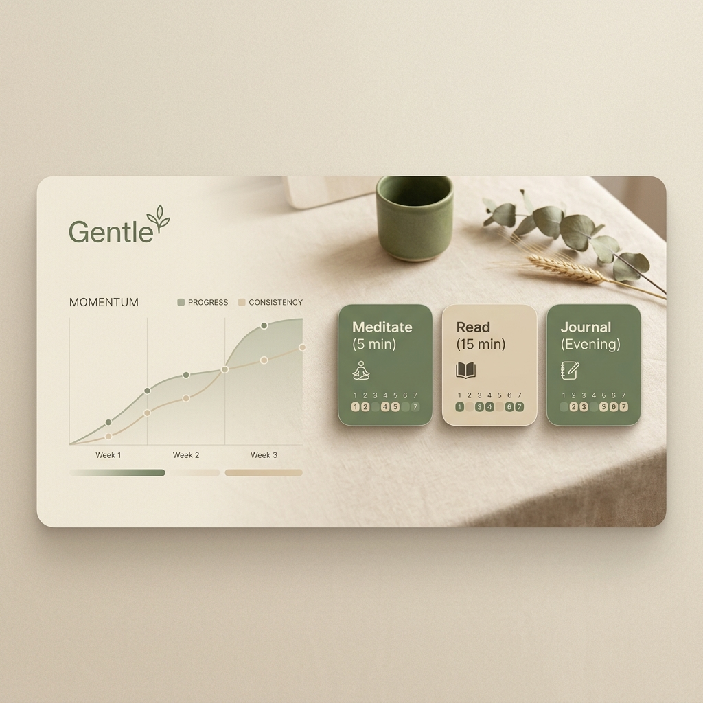

<div align="center">
  
  <br />
  <h1>Gentle</h1>
  <p><b>A minimalistic, ADHD-friendly habit tracker built for kindness, not pressure.</b></p>
  <br />
  
  [](#)
  [](#)
  [](#)
  [](#)
</div>

---

## 🌿 Philosophy

Most habit trackers are built around "streaks"—the pressure of not breaking a chain. For many, especially those with ADHD, a single missed day feels like failure. 

**Gentle is different.** 

We focus on **Momentum**, not streaks. No shame, no guilt, and no clinical checklists. Just a beautiful, fluid space to track your journey at your own pace.

## ✨ Core Experience

- **No-Shame Tracking**: Missed a day? No problem. The UI focuses on your long-term momentum, not a fragile count of consecutive days.
- **ADHD-Friendly Design**: High visual clarity, low friction, and variable card styles to keep the experience fresh and engaging.
- **The Momentum Dock**: A soft, non-judgmental visualization of your progress over weeks and months.
- **Atmosphere & Style**: 12+ curated themes (Parchment, Moss, Ink, Sakura, etc.) and multiple card layouts to match your aesthetic and mood.
- **Privacy First**: Local-first architecture. Your habits and data stay on your device.

---

## 🏗 Architectural Excellence: The 3-Layer Model

Gentle is built with a custom **3-Layer System** designed for maximum separation of concerns, scalability, and maintainability. This architecture ensures that visual identity is never coupled with layout logic.

### 1. The Page Layer (Orchestration)
`pages/*.tsx` — The manager. It decides **where** components sit on the screen and orchestrates page-level transitions using `system.css`.

### 2. The Component Layer (Arrangement)
`components/{feature}/*.tsx` — The worker. It defines how data is arranged (grids, lists) and handles feature-specific logic, but doesn't know its absolute position on the page.

### 3. The Segment Layer (Visual Identity)
`components/{feature}/Items.tsx` — The artist. Atomic visual units that define their own colors, borders, and interaction states. They are completely layout-agnostic.

> **The Gold Rule:** "The Component decides its visual identity and internal layout. The Page decides where that component sits. Nothing decides both."

---

## 🛠 Technical Highlights

### 🎨 Design System & CSS Responsibility
- **Strict Tokenization**: All colors, spacing, and typography are driven by a robust CSS variable system in `foundations.css`.
- **Placement vs. Visuals**: A unique separation where `system.css` handles only `position`, `inset`, and `z-index`, while component CSS handles `background`, `border`, and `padding`.
- **Dynamic Themes**: 12+ premium themes implemented with zero JavaScript overhead, purely via CSS data-attributes.

### ⚡ Performance & State
- **Atomic State**: Powered by **Zustand**, ensuring minimal re-renders even with complex habit grids.
- **Spring Physics**: Animations use **Framer Motion** with mathematical spring presets for a "tactile" and "organic" feel.
- **Local-First**: Instant UI updates with zero latency, persisting data locally for total privacy.

### 📱 Cross-Platform Ready
- **Capacitor Integration**: Ready to be deployed as a native Android or iOS app with a single command.
- **Responsive Geometry**: Uses a `geometry.css` layer to orchestrate border-radii across different screen sizes and safe-areas.

---

## 📦 Getting Started

### Prerequisites
- Node.js (v18+)
- npm

### Development
```bash
# Install dependencies
npm install

# Run dev server
npm run dev
```

---

## 🏛 Documentation

For a deep dive into the engineering principles, the CSS Responsibility Map, and expansion checklists, see the [ARCHITECTURE.md](./ARCHITECTURE.md).

<div align="center">
  <br />
  <p>Built with ❤️ for a gentler world.</p>
</div>